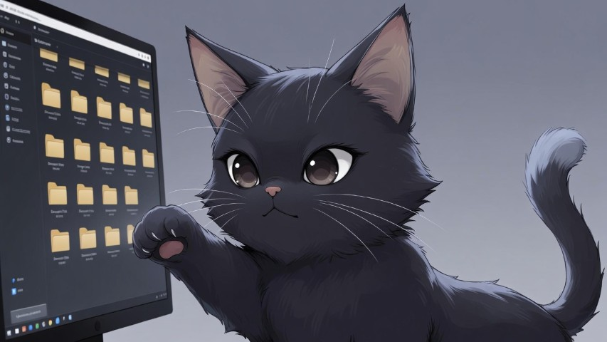
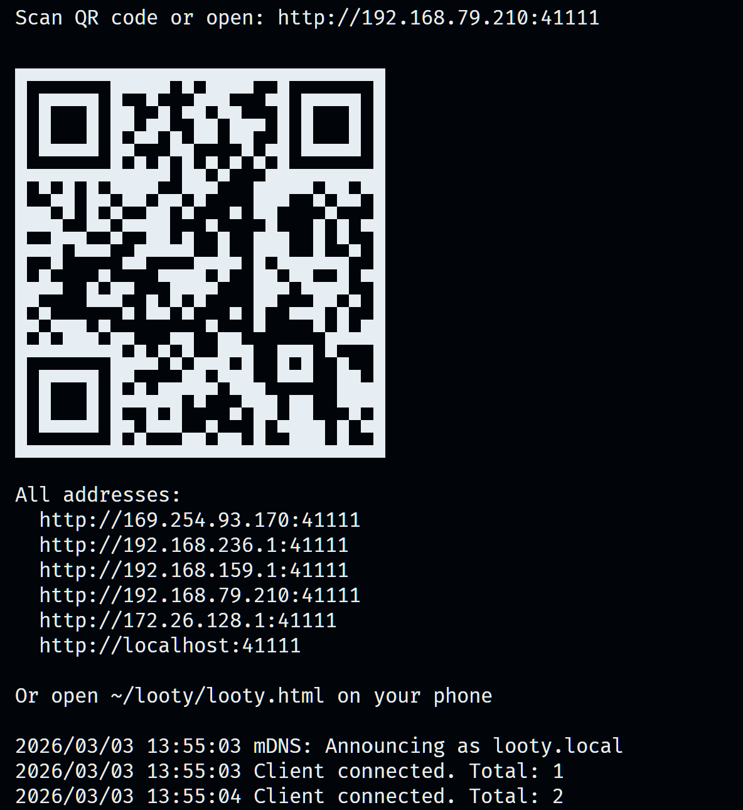
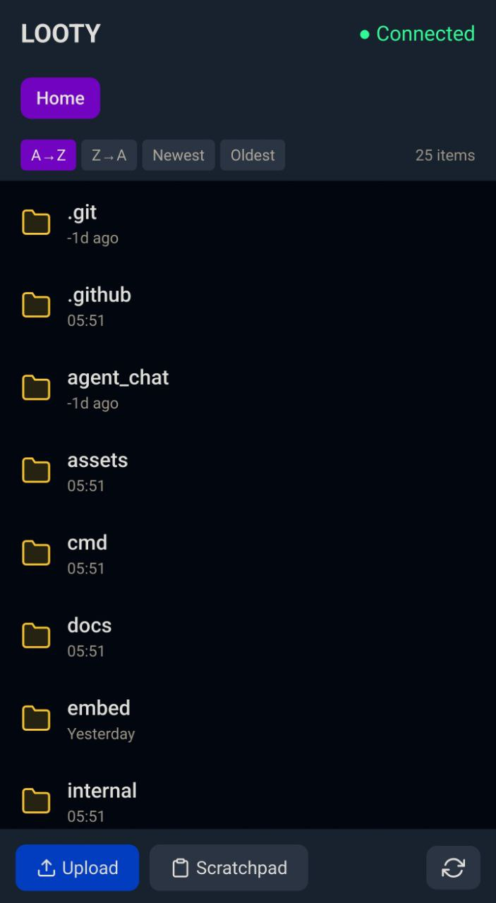
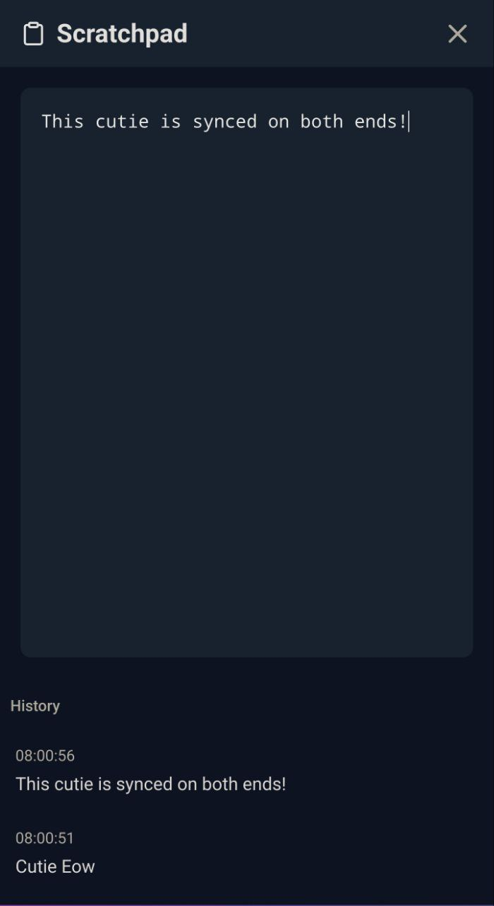

# Looty 🐱

A portable file sync & clipboard sharing tool between desktop and mobile on your local network. Zero config, auto-discovery, single executable.

[](https://go.dev/)
[](LICENSE)
[](https://github.com/lirrensi/looty/releases/latest)



---

## 📱 How It Works

**Zero Bullshit — 3 Steps:**

1. **Run Looty** in your terminal
2. **Scan the QR code** with your phone
3. **Open mobile, grab files** — done!

```
┌─────────────────────────────────────────────┐
│  🐱 Looty v0.1.0                            │
│                                             │
│  📱 Scan to connect:                        │
│                                             │
│       ████████████████                      │
│       ██          ██                        │
│       ██  ██  ██  ██                        │
│       ██    ██      ██                      │
│       ██  ██  ██  ██                        │
│       ██          ██                        │
│       ████████████████                      │
│                                             │
│  Or open: http://192.168.1.X:41111          │
│                                             │
│  🎯 Ready to sync!                          │
└─────────────────────────────────────────────┘
```

### Screenshots

| Desktop (Terminal) | Mobile (Files) | Mobile (Scratchpad) |
|--------------------|----------------|---------------------|
|  |  |  |

**That's it.** Run Looty → Scan QR → Use your phone as a wireless drive.

---

## ✨ Features

- 📱 **Zero-Config**: Auto-discovery on local network
- 📷 **QR Connect**: Scan QR code with your phone to connect instantly
- 🔄 **File Sync**: Drag & drop files between your desktop and phone
- 📋 **Clipboard Sync**: Copy text/pixels from desktop to mobile
- 💾 **Scratchpad**: Quick note-taking between devices
- 🌐 **Local Only**: No internet required, completely private
- 🚀 **Portable**: Single executable, runs anywhere

---

## 🚀 Quick Install

```bash
# macOS / Linux
curl -sL https://raw.githubusercontent.com/lirrensi/looty/main/install.sh | sh
```

```powershell
# Windows
irm https://raw.githubusercontent.com/lirrensi/looty/main/install.ps1 | iex
```

---

## 📦 Building from Source

### Prerequisites
- Go 1.25.5+
- Node.js 20+
- pnpm

### Build
```bash
# Clone the repo
git clone https://github.com/lirrensi/looty.git
cd looty

# Install frontend dependencies
cd web && npm install && cd ..

# Build
make build
```

The executable will be created in the root directory.

---

## 🛠️ Development

### Start the web dev server
```bash
cd web
pnpm install
pnpm dev
```

### Run tests
```bash
cd web
pnpm test
```

---

## 📁 Project Structure

```
looty/
├── cmd/blip/           # Main entry point
├── internal/
│   ├── clipboard/      # Clipboard sync logic
│   ├── files/          # File upload/download handlers
│   └── server/         # HTTP + WebSocket server
├── web/                # Frontend (Vite + Alpine + Tailwind)
├── embed/              # Embedded assets
└── assets/
    └── le_cat.jpg      # Looty mascot 🐱
```

---

## 🤝 Contributing

Contributions are welcome! Please feel free to submit a Pull Request.

---

## 📄 License

MIT License - see [LICENSE](LICENSE) for details.

---

## 🐱 Made with ❤️ for the local network